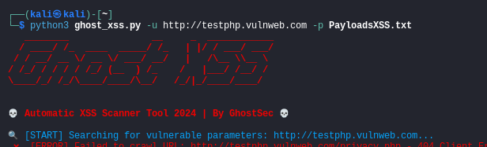

# 👻 Ghost XSS Scanner

💀 **Automatic XSS Scanner Tool 2024 | By GhostSec** 💀

---

## 📝 Description

Ghost XSS Scanner is a powerful tool for detecting Cross-Site Scripting (XSS) vulnerabilities. It crawls the target website, identifies parameters, and injects payloads to test for potential vulnerabilities. It is designed to find parameters affected by (XSS)

## ➡️ Features

- **Automated Crawling**: Collects and explores URLs from a base domain.
- **Parameter Testing**: Detects parameters in URLs and tests each with payloads to identify XSS vulnerabilities.
- **Selenium Integration**: Runs payloads within a browser environment to simulate real-world user interactions.
- **Custom Payloads**: Use your own XSS payloads to target specific attack vectors.
- **Colored Output**: Clearly indicates scan results with color-coded output for easy readability.
- **Result Logging**: Automatically saves scan results for further analysis and reporting.

---

## ⌛ Installation

1. **Clone the repository:**
   ```bash
   git clone https://github.com/fa-rrel/Ghost-XSS.git
   cd Ghost-XSS
   ```

2. **Install the required packages:**
   ```bash
   pip install -r requirements.txt
   ```

3. **Set up ChromeDriver:**
   - Download and install [ChromeDriver](https://sites.google.com/chromium.org/driver/) to use Selenium.
   - Ensure ChromeDriver version matches your Chrome browser version.

---

## 🚀 Usage

```bash
python ghost_xss.py -u <target_url> -p <payload_file>
```

- **`-u, --url`**: (Required) Base URL to scan for XSS vulnerabilities.
- **`-p, --payloads`**: Path to the payload file (default: `payloads.txt`).
- **`-o, --output`**: File to save scan results (default: `xss_scan_results.txt`).

### Example

```bash
python ghost_xss_scanner.py -u https://example.com -p custom_payloads.txt
```
<p style="text-align: left;">
  
</p>

Results will be saved to `xss_scan_results.txt` by default, or to a file specified with the `-o` option.

---

## ☕ Support

If you find this tool useful and want to support the development, consider buying me a coffee:
<a href="https://buymeacoffee.com/ghost_sec" target="_blank"></a>

---

## ⚠️ Disclaimer

This tool is intended for authorized security testing and educational purposes only. Unauthorized use against systems is strictly prohibited.

## 📄 License

Ghost XSS Scanner is licensed under the MIT License.
